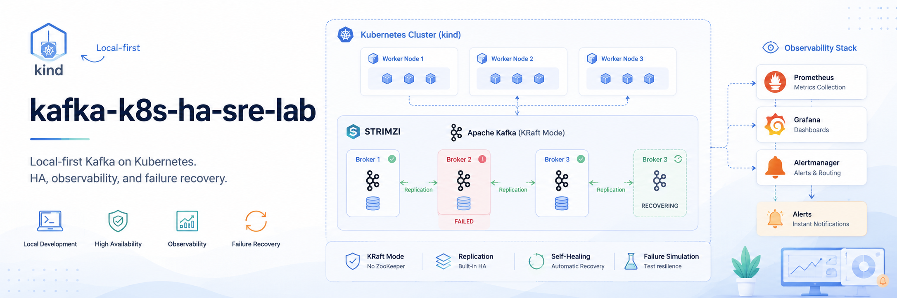
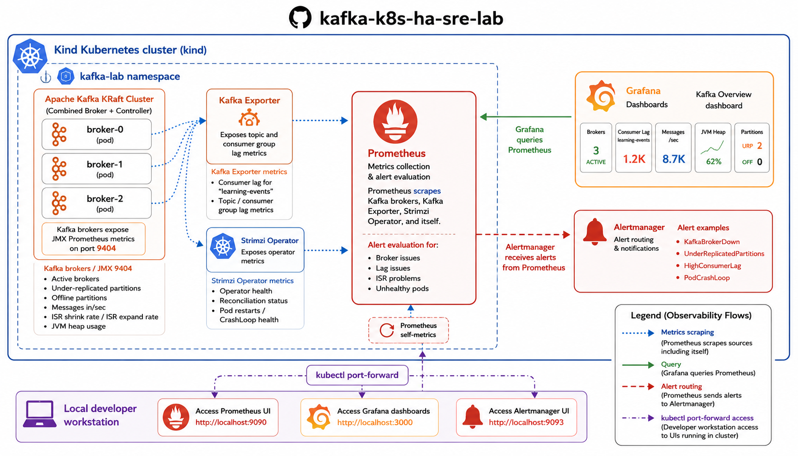
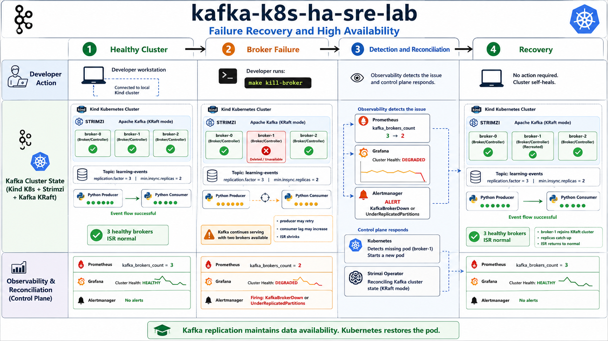

# Kafka HA on Kubernetes SRE Lab

[](https://github.com/kafka-k8s/kafka-k8s-ha-sre-lab/actions/workflows/kind-e2e-ha.yml)



Repository: <https://github.com/kafka-k8s/kafka-k8s-ha-sre-lab>

Local-first, production-minded SRE lab for running highly available Apache Kafka on Kubernetes with Strimzi, KRaft mode, Kind, Docker or Podman, Prometheus, Grafana, Alertmanager, and failure simulation workflows.

This repository is intentionally educational. It demonstrates real SRE thinking for Kafka on Kubernetes without requiring AWS, EKS, or any cloud account.

## Why This Project Exists

Many Kafka HA examples assume managed cloud infrastructure, large clusters, or incomplete toy deployments. This lab gives engineers a practical local environment for learning how Kafka replication, Kubernetes reconciliation, Strimzi automation, observability, and failure testing fit together.

The goal is not to claim that Kafka should always run on Kubernetes. The goal is to make the trade-offs visible and give engineers a repeatable place to practice.

## Architecture Summary


The MVP target architecture is:

- Kind Kubernetes cluster with one control-plane node and three worker nodes.
- Docker as the primary local container runtime.
- Podman as an alternative Kind provider.
- Strimzi Operator managing Kafka.
- Kafka in KRaft mode, not ZooKeeper.
- Three Kafka brokers where local resources allow.
- Topic `learning-events` with replication factor 3 and `min.insync.replicas=2` where possible.
- Python producer and consumer for educational platform events.
- Prometheus, Grafana, and Alertmanager for local observability.
- Failure scripts that delete one broker pod and verify recovery.

See [docs/architecture.md](docs/architecture.md) for diagrams and component details.

## Quick Start: Kind + Docker

Prerequisites:

- Docker running locally.
- [`kind`](https://kind.sigs.k8s.io/docs/user/quick-start/#installation) installed.
- `kubectl` installed.
- `make` installed.
- Python 3.11+ for the producer and consumer.

Recommended local resources: 4 CPU cores, 8 GB RAM, 20 GB free disk.

Clone the repository:

```sh
git clone https://github.com/kafka-k8s/kafka-k8s-ha-sre-lab.git
cd kafka-k8s-ha-sre-lab
```

**Step 1: Create the Kind cluster**

```sh
make cluster-up-docker
make nodes
```

**Step 2: Install Strimzi operator**

```sh
make install-strimzi
```

This downloads and installs Strimzi 0.43.0 into the `kafka-lab` namespace. Allow 2-3 minutes for the operator pod to become ready.

**Step 3: Deploy Kafka in KRaft mode**

```sh
make deploy-kafka
```

Three broker pods will start. Monitor until all are Running:

```sh
make status
```

Allow 2-5 minutes. All three `kafka-cluster-combined-*` pods must show `1/1 Running`.

**Step 4: Create the learning-events topic**

```sh
make create-topic
```

**Step 5: Run the producer**

Open a terminal and start the port-forward:

```sh
make port-forward
```

This forwards the local Kafka bootstrap port plus the three advertised broker
ports required by Kafka clients.

Open a second terminal and install the Python dependency, then send events:

```sh
pip install -r apps/requirements.txt
make produce
```

**Step 6: Run the consumer**

Open a third terminal:

```sh
make consume
```

The consumer reads from the beginning of the topic and exits after 30 seconds of inactivity.

**Step 7: Deploy observability**



```sh
make deploy-observability
make observability-status
```

In separate terminals, access the observability UIs:

```sh
make port-forward-prometheus        # http://localhost:9090
make port-forward-grafana           # http://localhost:3000  (admin/admin)
make port-forward-alertmanager      # http://localhost:9093
```

Validate that all targets are up:

```sh
make validate-observability
```

**Step 8: Simulate a broker failure**

```sh
make kill-broker
```

Watch recovery:

```sh
make verify-ha
```

While the broker is down, check the Prometheus Alerts page for `KafkaBrokerDown`.
The Grafana Kafka Overview dashboard shows Active Brokers dropping from 3 to 2.

Delete the local cluster when done:

```sh
make cluster-down
```

## Quick Start: Kind + Podman

Podman is an alternative runtime. Docker is the primary path because it has broader Kind compatibility across operating systems.

Prerequisites:

- Podman running locally (Podman Desktop or `podman machine start` on macOS/Windows).
- `kind` installed.
- `kubectl` installed.
- `make` installed.

Create the cluster:

```sh
make cluster-up-podman
make nodes
```

All subsequent steps (`make install-strimzi`, `make deploy-kafka`, etc.) are identical to the Docker path.

If Kind cannot connect to Podman, check:

```sh
podman info
podman ps
```

See [docs/troubleshooting.md](docs/troubleshooting.md) for common Podman issues.

## Optional Minikube Note

Minikube is documentation-only for the MVP. It can be useful for experiments, but driver, storage, and network behavior vary more than Kind. The main tested path should remain Kind.

## What This Project Demonstrates

- Kafka high availability concepts in a Kubernetes environment.
- Strimzi-managed Kafka lifecycle.
- KRaft-based Kafka deployment planning.
- Topic replication and `min.insync.replicas`.
- Producer durability with `acks=all`.
- Consumer lag as an SRE signal.
- Broker failure and recovery simulation.
- Prometheus metrics, Grafana dashboards, and Alertmanager alerts.
- Incident runbooks and production readiness thinking.



## What This Project Does Not Claim

- It is not a drop-in production Kafka platform.
- It does not prove production storage durability.
- It does not validate multi-zone or multi-region failure behavior.
- It does not replace capacity planning, load testing, security review, or disaster recovery testing.
- It does not claim Kafka on Kubernetes is always better than Kafka on VMs or bare metal.

## SRE Concepts Covered

- Service reliability boundaries.
- Failure mode analysis.
- Health checks and readiness.
- Broker restart versus true disaster recovery.
- Partition replication and ISR behavior.
- Alert design and runbook-driven operations.
- Local testing limits.
- Production checklist discipline.

## Core Demo Scenario


The intended end-to-end demo is:

1. Create a local Kind cluster.
2. Install Strimzi.
3. Deploy a Kafka KRaft cluster.
4. Create a topic named `learning-events`.
5. Send educational platform events with a Python producer.
6. Read events with a Python consumer.
7. Collect metrics with Prometheus.
8. View Kafka health and consumer lag in Grafana.
9. Delete one Kafka broker pod.
10. Validate recovery and continued message flow.

Sample event:

```json
{
  "student_id": "u-1021",
  "course": "english-a2",
  "event": "lesson_completed",
  "score": 91,
  "timestamp": "2026-05-19T12:00:00Z"
}
```

## Documentation Map

- [CONSTITUTION.md](CONSTITUTION.md): Engineering principles.
- [specs/kafka-k8s-ha-sre-lab/spec.md](specs/kafka-k8s-ha-sre-lab/spec.md): Product and technical specification.
- [specs/kafka-k8s-ha-sre-lab/plan.md](specs/kafka-k8s-ha-sre-lab/plan.md): Implementation plan including Phase 4 observability.
- [specs/kafka-k8s-ha-sre-lab/tasks.md](specs/kafka-k8s-ha-sre-lab/tasks.md): Step-by-step task breakdown.
- [docs/architecture.md](docs/architecture.md): Architecture diagrams and component flow.
- [docs/ha-design.md](docs/ha-design.md): Kafka HA design notes.
- [docs/kubernetes-vs-vm.md](docs/kubernetes-vs-vm.md): Kubernetes versus VM/bare metal trade-offs.
- [docs/local-testing.md](docs/local-testing.md): Local runtime guide including observability flow.
- [docs/e2e-validation.md](docs/e2e-validation.md): Exact local MVP validation commands.
- [docs/demo-output.md](docs/demo-output.md): Captured output from the local MVP validation run.
- [docs/disaster-recovery.md](docs/disaster-recovery.md): DR boundaries and future design.
- [docs/observability.md](docs/observability.md): Prometheus, Grafana, Alertmanager implementation and validation.
- [docs/security.md](docs/security.md): Local security and hardening plan.
- [docs/incident-runbook.md](docs/incident-runbook.md): Operational runbooks including alert mappings.
- [docs/troubleshooting.md](docs/troubleshooting.md): Common local issues including observability troubleshooting.
- [docs/production-checklist.md](docs/production-checklist.md): Production readiness checklist.

## Roadmap

- Phase 1: Documentation and repository scaffold. ✓
- Phase 2: Kind cluster and local setup. ✓
- Phase 3: Strimzi, Kafka KRaft, producer, consumer, failure scripts. ✓
- Phase 4: Prometheus, Grafana, Alertmanager implementation. ✓
- Phase 5: Security baseline — SASL/SCRAM, ACLs, NetworkPolicy.
- Phase 6: MirrorMaker 2, k3s/kubeadm variants, GitOps.
- Phase 7: Load testing, upgrade testing, backup automation.

## Resume Bullet Example

Designed and implemented a local-first Kafka high availability SRE lab on Kubernetes using Kind, Strimzi, KRaft mode, Prometheus, Grafana, Alertmanager, and failure simulation scripts to demonstrate broker recovery, topic replication, consumer lag monitoring, and production-minded operational runbooks without cloud dependencies.
