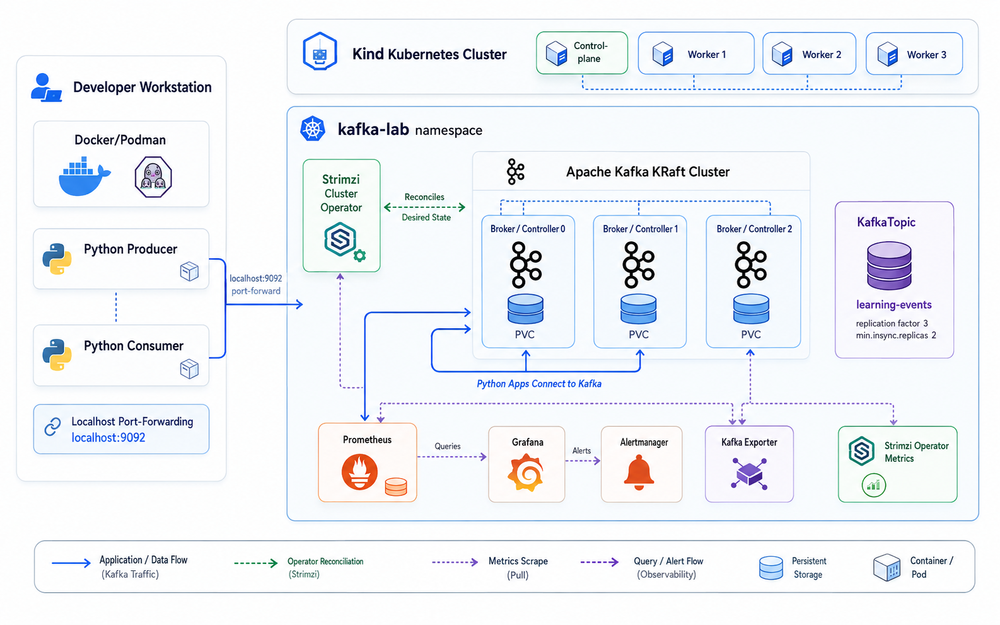
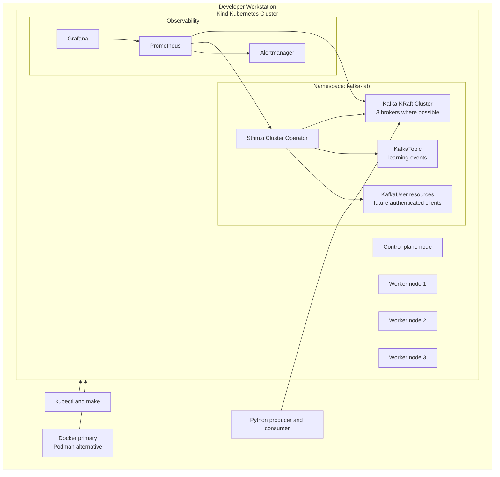
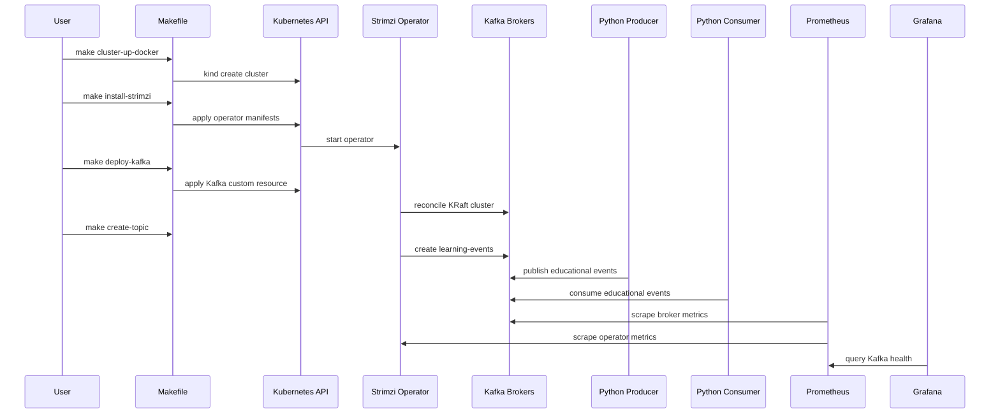

# Architecture

## Overview

`kafka-k8s-ha-sre-lab` is a local-first Kafka HA lab. It uses Kind to run a Kubernetes cluster on a developer workstation and Strimzi to operate Kafka in KRaft mode.

The architecture is intentionally small enough to run locally, but it mirrors production concerns: broker placement, persistent storage, replication, monitoring, alerts, runbooks, and failure testing.

## Infrastructure Diagram

## Component Diagram

## Request and Metrics Flow

## Kubernetes Design

The Kind cluster has one control-plane node and three worker nodes. The worker count is deliberate: it allows the lab to demonstrate spreading Kafka broker pods across separate Kubernetes nodes.

This is still a single-machine lab. It does not provide real hardware isolation, rack awareness, power isolation, or independent disk failure domains.

## Kafka Design

Kafka runs in KRaft mode. ZooKeeper is not used.

The intended Kafka deployment uses three brokers where local resources allow. The topic `learning-events` should use replication factor 3 and `min.insync.replicas=2`. Producers should use `acks=all`.

These settings demonstrate a common durability pattern: a write is acknowledged only after enough in-sync replicas have the data.

## Observability Design

Prometheus collects metrics from Strimzi and Kafka. Grafana visualizes operational state. Alertmanager receives local alerts.

The first dashboards and alerts should focus on:

- Broker availability.
- Kafka cluster readiness.
- Under-replicated partitions.
- Offline partitions.
- Consumer lag.
- Disk pressure and PVC usage.
- Pod restarts and crash loops.

## Failure Testing Design

The required MVP failure test is deleting one Kafka broker pod.

Expected behavior:

1. Kubernetes marks the pod deleted.
2. Kafka temporarily loses one broker.
3. Replicas on remaining brokers continue serving partitions where ISR is sufficient.
4. Strimzi and Kubernetes recreate the broker pod.
5. Kafka rejoins replicas and returns partitions to a healthy state.
6. Producer and consumer validation succeeds after recovery.

This is a broker restart test. It is not a full disaster recovery test.

## Extension Points

Future versions can add:

- Strimzi manifests pinned to a tested version.
- Grafana dashboards as JSON.
- PrometheusRule resources.
- MirrorMaker 2.
- k3s, kubeadm, or EKS guides.
- GitOps with Argo CD or Flux.
- Load testing and upgrade testing.
