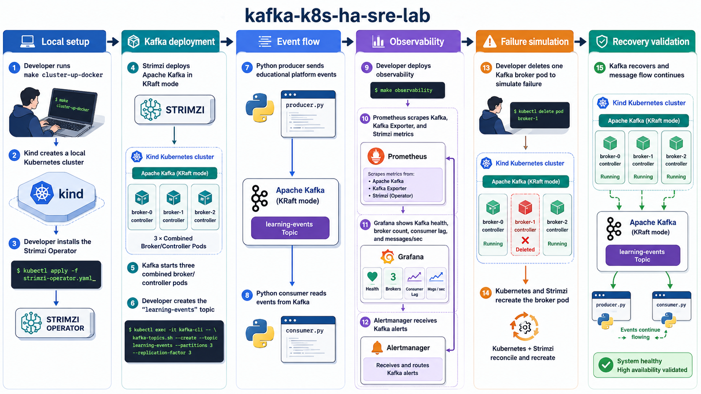

# End-to-End Local Validation

This runbook validates the current MVP on local Kind with Docker, including the
Phase 4 observability stack. It does not install AWS/EKS, Elasticsearch,
MirrorMaker 2, or any cloud service.



## Prerequisites

- Docker running locally.
- Kind installed.
- kubectl installed.
- make installed.
- Python 3 with pip.

For WSL users, run producer and consumer from the same environment where the
port-forward is running. If Kind was created with Windows `kind.exe`, export a
Linux-readable kubeconfig before starting the Linux `kubectl` port-forward:

```sh
kind.exe get kubeconfig --name kafka-k8s-ha-sre-lab > /tmp/kafka-lab-kind-kubeconfig
export KUBECONFIG=/tmp/kafka-lab-kind-kubeconfig
```

If your command names are different, override them:

```sh
KIND_BIN=kind.exe KUBECTL_BIN=kubectl.exe make cluster-up-docker
```

## Validation Commands

Create the Kind cluster:

```sh
make cluster-up-docker
```

Verify nodes:

```sh
make nodes
kubectl wait node --all --for=condition=Ready --timeout=180s
```

Install Strimzi:

```sh
make install-strimzi
```

Deploy Kafka:

```sh
make deploy-kafka
kubectl wait kafka/kafka-cluster -n kafka-lab --for=condition=Ready --timeout=600s
make status
```

Create the topic:

```sh
make create-topic
kubectl wait kafkatopic/learning-events -n kafka-lab --for=condition=Ready --timeout=180s
kubectl get kafkatopic learning-events -n kafka-lab
```

Install Python requirements:

```sh
pip install -r apps/requirements.txt
```

Start Kafka port-forward in a separate terminal:

```sh
make port-forward
```

Keep that terminal running. It forwards the local listener bootstrap and all
three advertised broker ports:

```text
localhost:9092   -> Kafka local bootstrap
localhost:19092  -> broker 0
localhost:19093  -> broker 1
localhost:19094  -> broker 2
```

Run producer:

```sh
make produce
```

Run consumer:

```sh
make consume
```

Deploy observability:

```sh
make deploy-observability
make observability-status
```

Start observability port-forwards in separate terminals:

```sh
make port-forward-prometheus
make port-forward-grafana
make port-forward-alertmanager
```

Validate observability:

```sh
make validate-observability
```

Expected Prometheus targets:

```text
kafka-brokers     3 up
kafka-exporter    1 up
strimzi-operator  1 up
prometheus        1 up
```

Useful Prometheus checks:

```sh
curl -G http://localhost:9090/api/v1/query \
  --data-urlencode 'query=count(up{job="kafka-brokers"} == 1)'

curl -G http://localhost:9090/api/v1/query \
  --data-urlencode 'query=sum(kafka_server_replicamanager_underreplicatedpartitions)'

curl -G http://localhost:9090/api/v1/query \
  --data-urlencode 'query=sum(kafka_controller_kafkacontroller_offlinepartitionscount)'

curl -G http://localhost:9090/api/v1/query \
  --data-urlencode 'query=sum(kafka_controller_kafkacontroller_activecontrollercount)'

curl -G http://localhost:9090/api/v1/query \
  --data-urlencode 'query=sum(kafka_consumergroup_lag{topic="learning-events"})'
```

Grafana should be reachable at <http://localhost:3000> with `admin/admin`.
The provisioned dashboard is `Kafka Overview`:

```text
http://localhost:3000/d/kafka-overview/kafka-overview
```

Alertmanager should be reachable at <http://localhost:9093>.

Simulate broker failure:

```sh
make kill-broker
```

Observe Prometheus and Grafana for up to two minutes:

```sh
curl -G http://localhost:9090/api/v1/query \
  --data-urlencode 'query=min_over_time((count(up{job="kafka-brokers"} == 1))[5m:15s])'

curl -s http://localhost:9090/api/v1/alerts | python3 -m json.tool
curl -s http://localhost:9093/api/v2/alerts | python3 -m json.tool
```

Short local restarts may only move alerts to `pending`. Alertmanager receives
alerts only after Prometheus rules reach `firing`.

Verify recovery:

```sh
make verify-ha
```

Confirm message flow after recovery:

```sh
make port-forward
```

Then in another terminal:

```sh
MESSAGE_COUNT=3 DELAY_SECONDS=0.2 make produce
TIMEOUT_SECONDS=10 make consume
```

If the original Kafka port-forward terminal was running during `make
kill-broker`, restart it before post-recovery client tests. A port-forward
attached to a deleted broker pod can lose its local socket.

Clean up when finished:

```sh
make cluster-down
```

## Expected Results

- Four Kind nodes are `Ready`.
- Strimzi operator pod is `1/1 Running`.
- Kafka reports `READY=True` and `METADATA STATE=KRaft`.
- `learning-events` reports `READY=True`.
- Producer sends all requested messages.
- Consumer reads the produced messages.
- Observability pods are `1/1 Running`.
- Prometheus reports all configured targets up.
- Grafana loads the provisioned Prometheus datasource and `Kafka Overview`
  dashboard.
- Alertmanager is reachable.
- During broker deletion, Prometheus records Kafka health degradation
  (`Active Brokers` may drop and under-replicated partitions may rise).
- `make verify-ha` reports `PASS`.
- Producer and consumer still work after one broker pod is deleted and restored.

## Output To Send For Debugging

If validation fails, send the output of:

```sh
make status
kubectl get pods -n kafka-lab -o wide
kubectl get kafka kafka-cluster -n kafka-lab -o yaml
kubectl get kafkatopic learning-events -n kafka-lab -o yaml
kubectl get events -n kafka-lab --sort-by=.lastTimestamp
kubectl logs -n kafka-lab deploy/strimzi-cluster-operator --tail=200
make observability-status
curl -s http://localhost:9090/api/v1/targets | python3 -m json.tool
curl -s http://localhost:9090/api/v1/alerts | python3 -m json.tool
curl -s http://localhost:9093/api/v2/alerts | python3 -m json.tool
```
